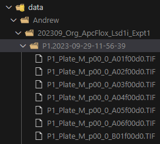
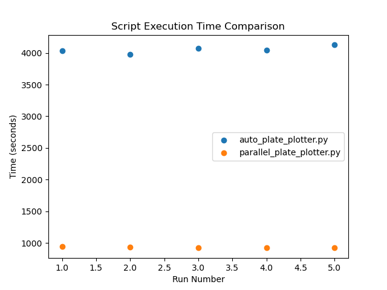

<h1>Intestinal organoid brightfield analysis</h1>

This repository contains a number of tools to speed up the interpretation and analysis of images from intestinal organoids acquired using a brightfield microscope. In our case an EVOS M7000 multiwell scanner which outputs the following filenames: P1_Plate_M_p00_z00_0_A01f00d0.

The scripts use the previously mentioned naming convention to extract the well_id from each image ("A01"), scan through all z-planes ("z00") and find the focal plane with the most organoids in focus. Then it generates a plate view of the entire multiwell plate at high resolution for data exploration.

This is a work in progress so I will be gradually including functionalities (feature extraction (morphology, nr of organoids per well) and object classification using deep learning)

<h2>Instructions</h2>

1. In order to run these Jupyter notebooks you will need to familiarize yourself with the use of Python virtual environments using Mamba. See instructions [here](https://biapol.github.io/blog/mara_lampert/getting_started_with_mambaforge_and_python/readme.html).

2. Then you will need to create a virtual environment using the following command:

<code>mamba create -n devbio-napari devbio-napari python=3.9 pyqt -c conda-forge</code>

3. I recommend going through the Jupyter notebooks (.ipynb) files in order to familiarize yourself with Napari (image viewer) and the script functionalities.

4. Once you have gone through the notebooks you can use **parallel_plate_plotter.py** to generate your plate views. I recommend pasting your imaging results within the data folder under your name for ease of use (i.e.<code>./data/John_Doe</code>).

5. As an example, to analyze the following images contained within the P1.2023-09-29-11-56-39 folder, one would define the PARENT_FOLDER global variable in **parallel_plate_plotter.py** as such:
   <code>PARENT_FOLDER = Path("./data/Andrew/202309_Org_ApcFlox_Lsd1i_Expt1")</code>
   All folders containing the images to be analyzed must live within that PARENT_FOLDER directory. 

<h2>Benchmarking</h2>

This repository contains two versions of the same script **auto_plate_plotter.py** and **parallel_plate_plotter.py**. The first one analyzes the plates in a sequential order, the second one analyzes all in parallel. If you have multiple plates to analyze at once use the parallel version.

I have benchmarked the analysis of 6 full p24 well plates, with 14 z-stacks per well (each individual z-stack being a ndarray of shape (1048, 1328, 3) and dtype('uint8')) in various systems. You can see the performance gains in different hardwares by using parallel processing below. Since I am using [PyClesperanto](https://github.com/clEsperanto/pyclesperanto_prototype) and [APOC](https://github.com/haesleinhuepf/napari-accelerated-pixel-and-object-classification) from [Robert Haase](https://github.com/haesleinhuepf) having an OpenCL GPU available should decrease processing times. I will be posting benchmarking results below (5 consecutive runs of each script using the **benchmark.py** tool):

<h3>AMD Ryzen 9 5900x + Nvidia RTX 3070 8GB VRAM</h3>

