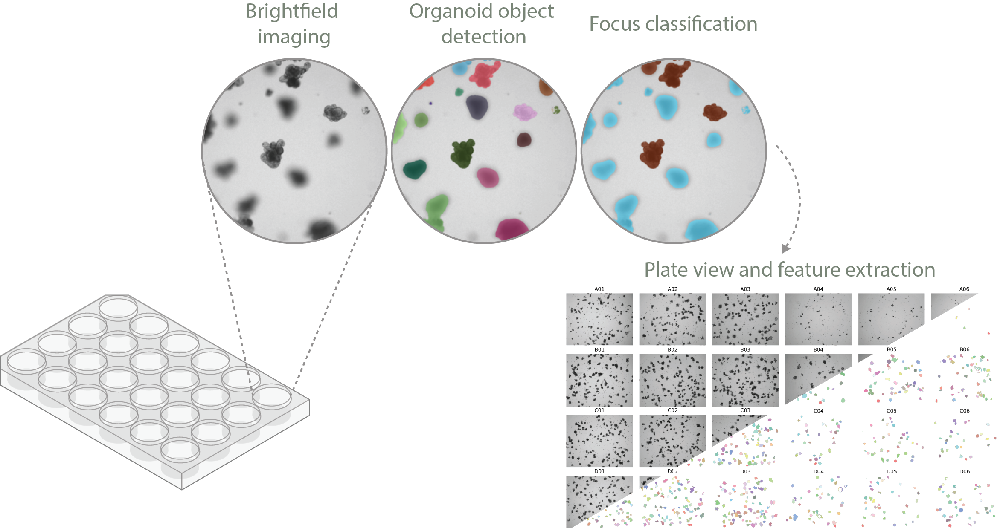

<h1>Intestinal organoid brightfield analysis (find_focus, deprecated)</h1>

This repository contains a number of tools to speed up the interpretation of images from intestinal organoids acquired using a widefield microscope (brightfield illumination). In our case an EVOS M7000 multiwell scanner which outputs the following filenames: _P1_Plate_M_p00_z00_0_A01f00d0_.

The scripts use the previously mentioned naming convention to extract the well_id from each image ("A01"), scan through all z-planes ("z00") and find the focal plane with the most organoids in focus. Then it generates a plate view of the entire multiwell plate at high resolution for data exploration. Filenames **must contain the well_id identifier** in order for the scripts to work and plot the plate views.

For object segmentation and classification using deep learning (YOLOv8 from ultralytics) please visit the newest iteration of this project here: [here](https://empty-link.html).

<h2>TL;DR</h2>

Hey, I just want to plot my plate views with no coding at all. Lucky you, I will run you through the steps.

1. At the top of this page, click on the green **Code** button, then click on **Download ZIP**.

2. Extract the folder, in this example under: <code>C:\Users\albertds\Python_scripts</code>.

3. Inside <code>intestinal_organoid_brightfield_analysis</code> you will see a <code>data</code> folder, create a folder with <code>your_name</code> inside said data folder.

4. Paste the plate folders containing the images you acquired inside <code>data/your_name</code>.

At this point, you will need to follow steps 1 and 2 from the **Instructions** section below to create the necessary Python virtual environment.

1. Afterwards, inside the Miniforge Prompt (terminal) where you just created your first virtual environment type and hit enter:
   <code>mamba activate napari-devbio</code>

2. Once your virtual environment is (active), using the <code>cd</code> command inside the terminal navigate to where you just downloaded (or cloned) this repository. In my case:

   

3. Then, inside the terminal, type <code>python ppp_GUI.py</code> and hit enter. After a few seconds a GUI like you see below (but with empty fields) will appear:

   

4. If you were to analyze the images inside folders P1.2023-09-29-11-56-39 and P1.2023-10-02-08-13-59 under the path shown below, you will need to fill the GUI as shown above.
   

5. Input your desired Resolution for the plate views you will obtain (600 dpi offer almost native resolution) and Username for the folder that will contain the ouput plate views, images in focus and segmentations.

6. Click on generate plate views.

<h2>Instructions</h2>

1. In order to run these Jupyter notebooks and .py scripts you will need to familiarize yourself with the use of Python virtual environments using Mamba. See instructions [here](https://biapol.github.io/blog/mara_lampert/getting_started_with_mambaforge_and_python/readme.html).

2. Then you will need to create a virtual environment either using the following command or recreate the environment from the .yml file you can find in the envs folder:

   <code>mamba create -n napari-devbio python=3.9 devbio-napari cellpose pytorch torchvision plotly pyqt ultralytics -c conda-forge -c pytorch</code>

3. I recommend going through the Jupyter notebooks (.ipynb) files in order to familiarize yourself with Napari (image viewer) and the script functionalities. Particularly [1_train_and_setup.ipynb](1_train_and_setup.ipynb) if the resulting plate views are out of focus.

4. Once you have gone through the notebooks you can use **parallel_plate_plotter.py** to generate your plate views. I recommend pasting your folders containing your images within the data folder under your name for ease of use (i.e.<code>./data/John_Doe</code>).

5. As an example, to analyze the following images contained within the P1.2023-09-29-11-56-39 folder, one would define the PARENT_FOLDER global variable in **parallel_plate_plotter.py** as such:

   <code>PARENT_FOLDER = Path("./data/Andrew/202309_Org_ApcFlox_Lsd1i_Expt1")</code>

   All folders containing the images to be analyzed must live within that PARENT_FOLDER directory.

   

6. Inside **parallel_plate_plotter.py**, you would also want to define the <code>RESOLUTION</code> (in dpi) at which you want to obtain your plate views, your <code>USERNAME</code> to define your output folder and which <code>PLATE_VIEWS</code> you want to obtain. I.e. if you just want to see the grayscale plate views you define the global variable <code>PLATE_VIEWS = ["grayscale"]</code> as such.

7. Once you have defined the directory containing your images, your username and your desired output plate views you can run the script.

<h2>Benchmarking</h2>

This repository contains two versions of the same script **auto_plate_plotter.py** and **parallel_plate_plotter.py**. The first one analyzes the plates in a sequential order, the second one analyzes all in parallel. If you have multiple plates to analyze at once use the parallel version.

I have benchmarked the analysis of 6 full p24 well plates, with 14 z-stacks per well (each individual z-stack being a ndarray of shape (1048, 1328, 3) and dtype('uint8')) in various systems. You can see the performance gains in different hardwares by using parallel processing below. Since I am using [PyClesperanto](https://github.com/clEsperanto/pyclesperanto_prototype) and [APOC](https://github.com/haesleinhuepf/napari-accelerated-pixel-and-object-classification) from [Robert Haase](https://github.com/haesleinhuepf) having an OpenCL GPU available should decrease processing times. I will be posting benchmarking results below (5 consecutive runs of each script using the **benchmark.py** tool):

<h2>Help and contact</h2>

Feel free to get in touch with me for help at: <alberto.d.sanchez@ntnu.no>
